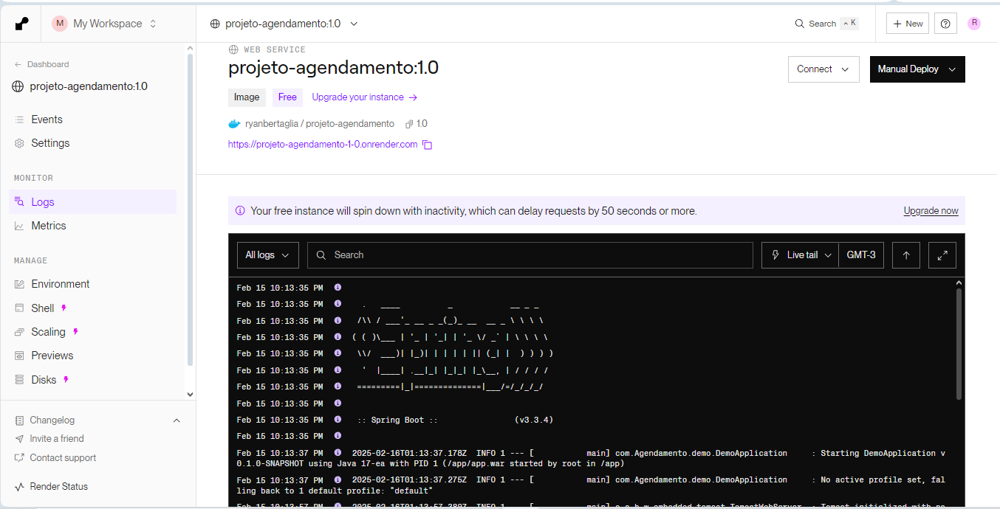
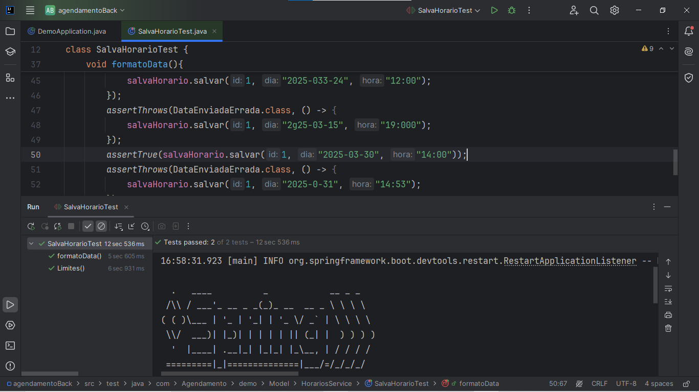
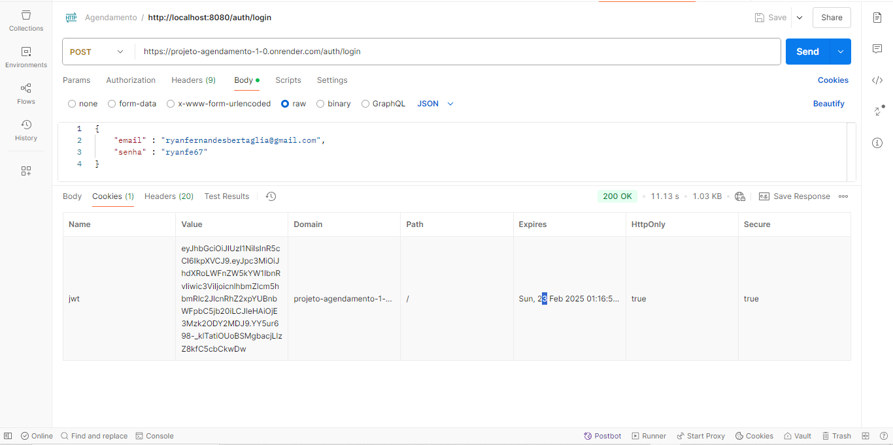
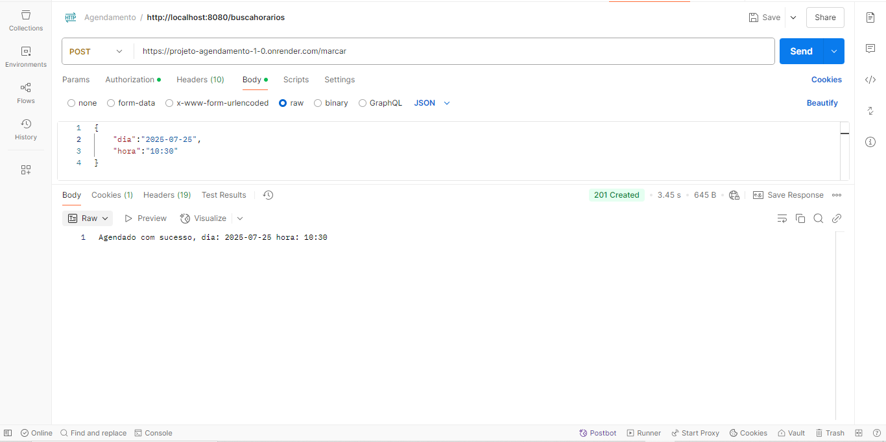

# Projeto API Agendamento

## Descrição
Esta API foi desenvolvida utilizando **Java** com **Spring Boot** e **Spring Security** para gerenciar agendamentos. A aplicação permite que os usuários façam login e, a partir da autenticação, possam agendar dias para compromissos, consultas ou eventos. A segurança é implementada com **JSON Web Tokens (JWT)**, e os dados são persistidos em um banco de dados **PostgreSQL**. O projeto é gerenciado com **Maven** e utiliza **Docker** para facilitar a criação em ambientes diferentes.

---

## Funcionalidades
    - **Autenticação de Usuário:**
    - Endpoint para login que valida as credenciais e retorna um JWT.
    - **Autorização com JWT:**
    - Uso do token JWT para garantir que apenas usuários autenticados acessem os endpoints protegidos.
    - **Agendamento de Dias:**
    - Permite que usuários autenticados criem, consultem e, se aplicável, cancelem agendamentos.

---

## Tecnologias Utilizadas

- **Java 17**
- **Spring Boot**
- **Spring Security**
- **JWT**
- **PostgreSQL**
- **Maven**
- **Docker**
- **JUnit**

---

### Antes certifique-se de ter:
- Java JDK 11 (ou superior)
- Maven 3.6
- Docker
    
### Passo a passo

1. Clone o repositório:
   > git clone https://github.com/seuusuario/projeto-agendamento-api.git
  
2. Acesse o diretório do projeto:
   > cd projeto-agendamento-api

3. Compile e execute a aplicação:
   > mvn clean install
   > mvn spring-boot:run

---

### Caso queira executar em um container:
#### A partir do Docker file no terminal ececute:  
    docker build -t suaimagem .
    docker run --name seu_container -p 8080:8080 suaimagem

---

## Aplicação em alguns ambientes
### Ambiente de produção

### Dados recebidos no BD PostgreSQL 

    
## Testes Funcionais com JUnit

### Aplicação no Postman

