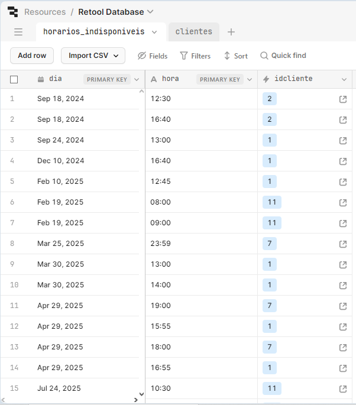
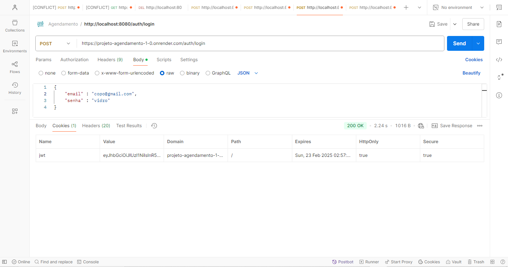

# Projeto API Agendamento

## Descrição
Esta API foi desenvolvida utilizando **Java** com **Spring Boot** e **Spring Security** para gerenciar agendamentos. A aplicação permite que os usuários façam login e, a partir da autenticação, possam agendar dias para compromissos, consultas ou eventos. A segurança é implementada com **JSON Web Tokens (JWT)**, e os dados são persistidos em um banco de dados **PostgreSQL**. O projeto é gerenciado com **Maven** e utiliza **Docker** para facilitar a criação em ambientes diferentes.

## Funcionalidades
- **Autenticação de Usuário:**
    - Endpoint para login que valida as credenciais e retorna um JWT.
- **Autorização com JWT:**
    - Uso do token JWT para garantir que apenas usuários autenticados acessem os endpoints protegidos.
- **Agendamento de Dias:**
    - Permite que usuários autenticados criem, consultem e, se aplicável, cancelem agendamentos.

## Tecnologias Utilizadas

```
- **Java 17**
- **Spring Boot**
- **Spring Security**
- **JWT**
- **PostgreSQL**
- **Maven**
- **Docker**
- **JUnit**
```

## Pré-requisitos
- **Java JDK 11** (ou superior)
- **Maven 3.6+**
- **Docker** e **Docker Compose** (opcional, para rodar em containers)

## Instalação e Configuração

1. **Clone o repositório:**
   ```bash
   git clone https://github.com/seuusuario/projeto-agendamento-api.git
   
# Aplicação em alguns ambientes
    ### Ambiente de produção


    ### Dados recebidos no BD PostgreSQL 

    
    ## Testes Funcionais com JUnit


    ### Aplicação no Postman


